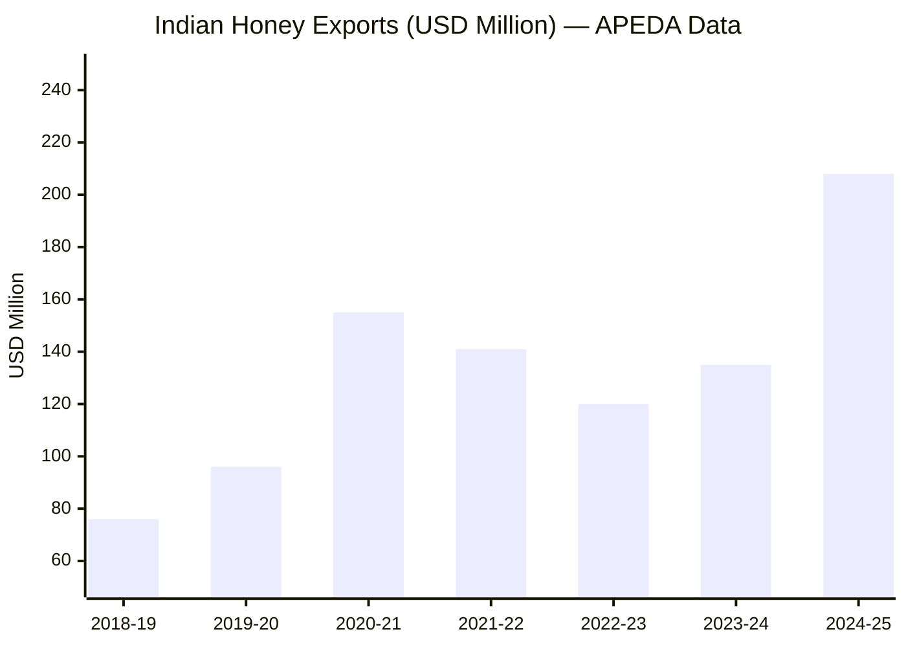
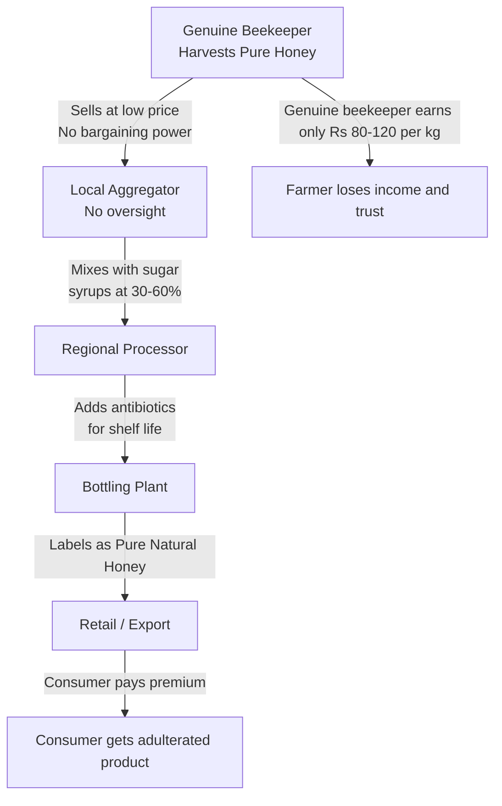
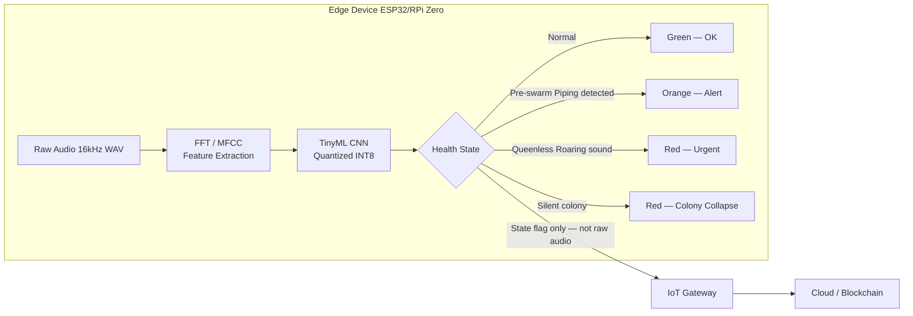
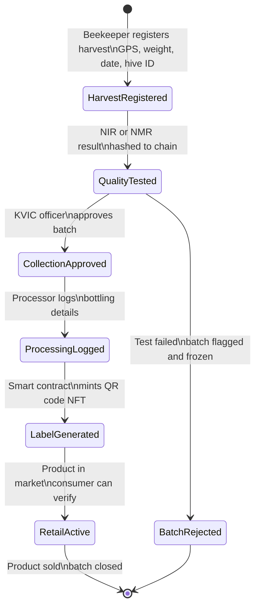
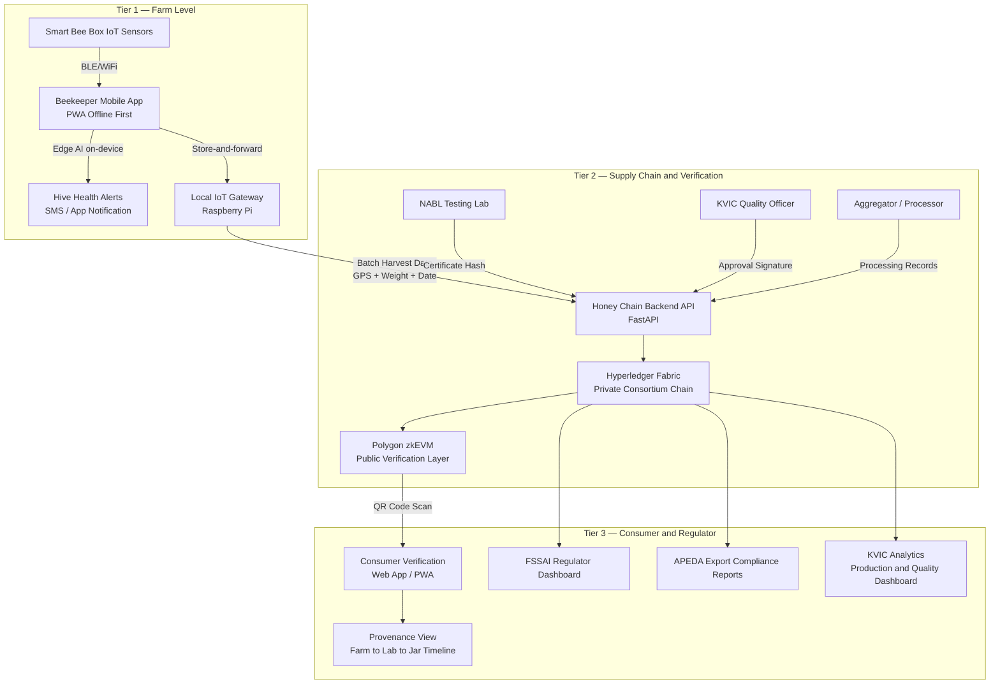
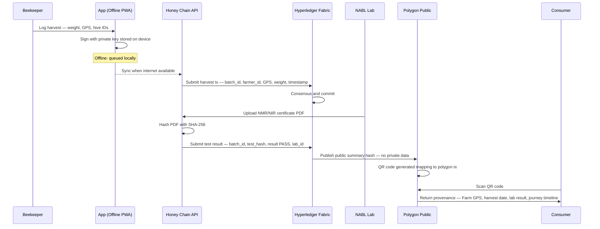
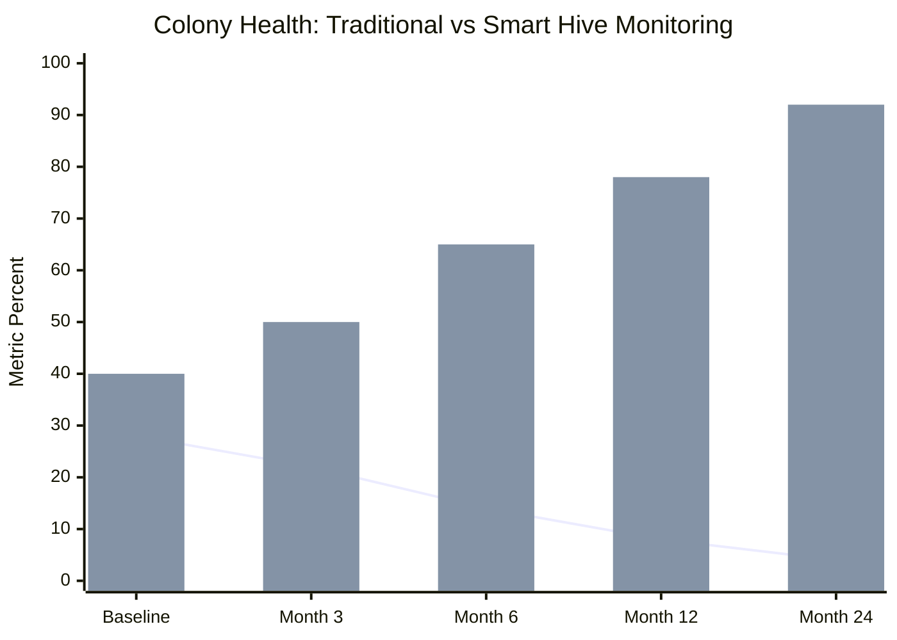

# SIH 21 (SIH26021) — Honey Chain
## Blockchain-Based Honey Traceability & Smart Beekeeping Management

---

> **PS Code:** SIH26021
> **Theme:** Agriculture, FoodTech & Rural Development
> **Organization:** Ministry of MSME / Khadi and Village Industries Commission (KVIC)
> **Category:** Software
> **Year:** SIH 2026

---

## Table of Contents
1. [Problem Context & Background](#1-problem-context--background)
2. [India's Honey Industry — The Hard Numbers](#2-indias-honey-industry--the-hard-numbers)
3. [The Adulteration Crisis](#3-the-adulteration-crisis)
4. [KVIC's Honey Mission — Current State](#4-kvics-honey-mission--current-state)
5. [What the Solution Must Do](#5-what-the-solution-must-do)
6. [Why Existing Approaches Fail](#6-why-existing-approaches-fail)
7. [Technical Deep Dive — IoT Smart Hives](#7-technical-deep-dive--iot-smart-hives)
8. [Technical Deep Dive — Adulteration Detection](#8-technical-deep-dive--adulteration-detection)
9. [Technical Deep Dive — Blockchain Architecture](#9-technical-deep-dive--blockchain-architecture)
10. [Proposed Architecture — HONEY CHAIN Ecosystem](#10-proposed-architecture--honey-chain-ecosystem)
11. [System & Data Flow Diagrams](#11-system--data-flow-diagrams)
12. [Mobile App — Rural-First Design](#12-mobile-app--rural-first-design)
13. [Technology Stack](#13-technology-stack)
14. [Expected Impact & Metrics](#14-expected-impact--metrics)
15. [Sources & References](#15-sources--references)

---

## 1. Problem Context & Background

India is the **world's second-largest honey producer**, yet it is also one of the most scrutinized for adulteration and food fraud. The paradox: a country with millions of rural beekeepers, rich biodiversity, and high-quality natural honey, yet plagued by systemic fraud at the processing and bottling stage.

The KVIC runs India's flagship **National Beekeeping and Honey Mission (NBHM)**, which distributes bee boxes, live colonies, and toolkits to rural beekeepers. But once honey leaves the beekeeper's apiary, the trail goes completely dark. There is no traceability. Any processor can mix, dilute, or adulterate the honey before bottling, and no consumer or regulator can prove otherwise.

The consequences are severe:
- India has faced repeated **export bans** from the EU and US over antibiotic residues and adulteration
- A landmark CSE study found **77% of major Indian honey brands failed NMR tests**
- Genuine rural beekeepers earn far less because their authentic honey cannot command a premium — they can't prove its authenticity

---

## 2. India's Honey Industry — The Hard Numbers

| Metric | Value |
|---|---|
| **Annual Production** | ~151,000 tonnes (1.51 lakh MT) — 2025-26 estimate |
| **Global Rank** | 2nd largest producer |
| **Number of Beekeepers** | ~5,000,000 (50 lakh) associated; 2.5–3 lakh active |
| **Bee Boxes (KVIC distributed)** | 2,46,099 bee boxes with live colonies (as of May 2026) |
| **Export Value** | ~USD 208 million (₹1,700+ crores) |
| **Top Export Destination** | United States (~76% of all honey exports) |
| **Honey Failure Rate (NMR test)** | **77%** of major branded honeys failed in CSE 2020 study |
| **Key Adulterants Detected** | Rice syrup, corn/C4 sugar syrup, beet sugar syrup |
| **Antibiotic Contamination** | Chloramphenicol, Streptomycin, Tetracycline — basis of EU bans |

### Export Value Trend



---

## 3. The Adulteration Crisis

### 3.1 How Adulteration Happens — The Full Chain



### 3.2 Types of Adulteration and Detection Difficulty

| Adulterant | Source | Detection Method | Difficulty |
|---|---|---|---|
| **C4 Sugar Syrups** (corn, cane) | Cheapest adulterant | IRMS Isotope Ratio — reliable | Medium |
| **C3 Syrups** (rice, beet) | Evades C4 tests | NMR only — expensive | High |
| **Modified C3 Syrups** | Specifically designed to evade NMR | Advanced NMR + chemometrics | Very High |
| **Chloramphenicol** | Antibiotic residue from hive treatment | LC-MS/MS | Medium |
| **Streptomycin** | Antibiotic for AFB disease | ELISA / LC-MS | Medium |
| **Water over-moisture** | Dilution | Refractometer — cheap | Very Low |

### 3.3 History of Export Bans
- **2010–2012 (EU Ban):** Indian honey banned for chloramphenicol contamination and lack of traceability infrastructure
- **2022 (US Anti-Dumping Probe):** US CBP launched probes on Indian honey exporters citing rice syrup adulteration targeting NMR evasion
- **FSSAI Response (2020):** Made NMR testing mandatory for exports — domestic market remains largely unprotected

---

## 4. KVIC's Honey Mission — Current State

| Parameter | Current State | Gap |
|---|---|---|
| **Technology Used** | Traditional — paper ledgers, phone calls | Zero digital traceability |
| **Health Monitoring** | Physical inspection every 1–3 months | Diseases detected late; colony collapse |
| **Madhukranti Portal** | Launched for beekeeper registration | No IoT/blockchain; just a registry |
| **Lab Testing** | Only at export stage, few certified labs | No routine on-farm or cooperative testing |
| **Market Linkage** | KVIC honey marts + cooperatives | Limited, low prices for genuine honey |
| **Subsidy Disbursement** | Manual, slow, leakage-prone | No digital trail from subsidy to output |

---

## 5. What the Solution Must Do

### 5.1 Smart Beekeeping (IoT + AI)
- IoT sensors retrofittable onto existing KVIC bee boxes (low-cost, <₹2,000 per hive)
- Monitor: temperature, humidity, weight, acoustic signature, CO₂
- AI model on edge device to detect: swarming risk, queenlessness, Varroa mite infestation, starvation
- Push alerts to beekeeper's phone via SMS/App

### 5.2 Blockchain Traceability
- Every batch of honey (from harvest to jar) tracked as a unique transaction
- Each event (harvesting, testing, processing, packaging, retail) recorded on-chain
- QR code on product: scan → see full immutable provenance
- Smart contracts to auto-trigger payouts to farmers upon verified harvest events

### 5.3 Consumer Transparency
- Verifiable honey purity (test certificate hash stored on-chain)
- Geographic origin proof (GPS coordinates of apiary on-chain)
- Batch-level traceability down to specific hive clusters

### 5.4 Scalability & Accessibility
- Must work for illiterate rural farmers (voice interface, vernacular support)
- Must work offline-first (no consistent internet in many rural areas)
- Scalable across all KVIC honey districts

---

## 6. Why Existing Approaches Fail

| Approach | Problem |
|---|---|
| **Madhukranti Portal** | Static registry, no real-time data, no blockchain, no IoT |
| **FSSAI NMR Mandate (Export Only)** | Domestic market unprotected; doesn't trace origin |
| **Private Certifications** | Expensive, not verifiable by consumer, open to forgery |
| **Standard QR Codes** | Centralized — manufacturer can change backend data; not trustless |
| **SAP/Oracle Supply Chain** | Not accessible to rural beekeepers; no IoT hive integration |

---

## 7. Technical Deep Dive — IoT Smart Hives

### 7.1 Sensor Suite for KVIC Bee Boxes

| Sensor | Target Measurement | Specification | Cost (Approx) |
|---|---|---|---|
| **Acoustic Microphone (MEMS)** | Bee buzz frequency | 200–500 Hz normal; 400–600 Hz pre-swarm piping | Rs 150–300 |
| **Load Cell (Weight)** | Honey yield, colony growth | ±20–50g accuracy; 0–50kg range | Rs 200–500 |
| **DHT22 / SHT31 (Temp/Humidity)** | Brood nest climate | Healthy: 34–35°C, 40–60% RH | Rs 80–200 |
| **CO₂ Sensor (MH-Z19)** | Ventilation quality | Healthy hive: 2,500–3,000 ppm | Rs 400–600 |
| **Infrared Camera (optional)** | Varroa detection at entrance | Pi Camera + ML model | Rs 800–1,500 |

**Target smart hive kit total cost: < Rs 2,000 per hive** — within KVIC subsidy capability

### 7.2 Existing Smart Hive Products (Global Benchmarks)

| Product | Sensors | Price USD | Gap for India |
|---|---|---|---|
| **BroodMinder** | Temp, weight | $100–150 | Too expensive; no India support |
| **Arnia** | Full acoustic + weight + temp | $300+ | Very expensive; enterprise only |
| **Solutionbee** | Weight only | $60 | Limited analysis capability |
| **HONEY CHAIN kit (proposed)** | Acoustic + weight + temp/humidity + CO₂ | **$20–25** | Custom-built for KVIC, offline-first |

### 7.3 AI Model for Hive Health Detection — TinyML Pipeline



**Why Edge AI / TinyML:**
- Rural areas have poor bandwidth; sending raw audio to cloud is infeasible
- A quantized CNN (INT8) for audio classification runs on ESP32 at < 20mW power
- Only the "health state flag" (a few bytes) is transmitted, not the raw audio stream
- Models trained on MFCC spectrograms achieve >90% accuracy on swarm vs normal classification

### 7.4 Varroa Mite Detection
- **Vision-based:** Camera at hive entrance; CNN (MobileNetV3 on-device) identifies mite-infested bees by deformed wing virus (DWV) symptoms
- **Acoustic:** Varroa-infested colonies show measurable changes in buzz frequency — used as early warning before visual infestation is visible

---

## 8. Technical Deep Dive — Adulteration Detection

### 8.1 Detection Method Comparison

| Method | What it Detects | Cost | Turnaround | On-Chain Integration |
|---|---|---|---|---|
| **Refractometer** | Water/moisture only | Rs 500 one-time | Instant | Basic pass/fail |
| **IRMS Isotope Ratio** | C4 sugars (corn, cane) | Rs 3,000–5,000/sample | 3–5 days | Certificate hash |
| **NIR Spectroscopy** | Quick screening C3+C4 | Rs 80,000 device; Rs 50/sample | Minutes | Result hash + model version |
| **DNA Barcoding** | Floral origin verification | Rs 2,000–4,000/sample | 7 days | Species list hash |
| **NMR Testing 400MHz** | Everything including C3 syrups | Rs 8,000–15,000/sample | 3–7 days | Full PDF certificate hash |

### 8.2 Recommended Detection Pipeline
```
On-farm: Refractometer check (moisture) →
Cooperative: NIR screening →
NABL Lab: IRMS (export batches) →
NABL Lab: NMR (premium export) →
All results hashed → Stored on-chain as oracle attestations
```

---

## 9. Technical Deep Dive — Blockchain Architecture

### 9.1 Chain Selection for Rural India

| Feature | Hyperledger Fabric | Polygon PoS | Ethereum Mainnet |
|---|---|---|---|
| **Gas Fees** | **None** | ~$0.001 | $5–50+ |
| **Privacy** | Full (channels) | Low | None |
| **Throughput** | 3,500+ TPS | 7,000 TPS | 15 TPS |
| **Offline Sync** | **Yes (store-and-forward)** | Partial | No |
| **Consortium Control** | Full | Partial | None |
| **Best For** | KVIC consortium layer | Public consumer verification | Unsuitable |

**Recommended: Hybrid Architecture**
- **Hyperledger Fabric** (private): Between KVIC, NABL labs, processors, FSSAI — for sensitive batch and test data
- **Polygon zkEVM** (public): Consumer-facing QR code verification — data hashed and posted publicly, enabling trustless consumer verification without revealing private business data

### 9.2 Smart Contract Lifecycle



---

## 10. Proposed Architecture — HONEY CHAIN Ecosystem



---

## 11. System & Data Flow Diagrams

### Consumer QR Verification — Detailed Flow



### Colony Health Impact Metrics


*Line: Annual Colony Mortality Rate (%) | Bar: Beekeeper Yield Efficiency (%)*

---

## 12. Mobile App — Rural-First Design

| Principle | Implementation |
|---|---|
| **Offline-First** | Service Workers (PWA) cache all UI and queue blockchain transactions locally |
| **Vernacular Language** | Hindi, Marathi, Bengali, Punjabi, Gujarati via i18n; Bhashini AI API for voice |
| **Low Literacy Support** | Icon-heavy UI; voice commands in regional languages |
| **USSD Fallback** | Feature phone users dial *99# to check market prices, log basic harvest data |
| **DigiLocker Integration** | Aadhaar-based eKYC via API Setu for KVIC subsidy onboarding — paperless |
| **WhatsApp Bot** | Most rural users have WhatsApp; bot allows logging harvest and health alerts |
| **Low Data Mode** | Only transmit compressed JSON; no images unless on WiFi |

---

## 13. Technology Stack

| Layer | Technology | Why |
|---|---|---|
| **IoT Hardware** | ESP32 + SHT31 + HX711 + MEMS mic | Cheap, widely available, BLE+WiFi |
| **Edge AI** | TensorFlow Lite / TinyML on ESP32 | Runs CNN inference without cloud; < 20mW |
| **IoT Protocol** | MQTT via HiveMQ | Lightweight; works on 2G/3G networks |
| **Blockchain (Private)** | Hyperledger Fabric 2.5 | Permissioned, free transactions, privacy channels |
| **Blockchain (Public)** | Polygon zkEVM | Cheap, fast, EVM-compatible public verification |
| **Smart Contracts** | Solidity (Polygon) + Go Chaincode (Fabric) | Standard, well-documented |
| **Backend** | FastAPI (Python) | Async, fast, ML model integration |
| **Database** | PostgreSQL + IPFS for PDFs | IPFS for decentralized document storage |
| **Frontend PWA** | React.js + Workbox service workers | Offline support, no app store |
| **Analytics** | Apache Superset | Open-source KVIC dashboard |
| **Voice / NLP** | Bhashini AI ULCA API | Indian govt multilingual AI |
| **KYC** | DigiLocker + API Setu | Aadhaar-based paperless onboarding |

---

## 14. Expected Impact & Metrics

| KPI | Current | Target Post Honey Chain |
|---|---|---|
| **Colony Mortality Rate** | ~28% annually | **< 5%** with IoT early warning |
| **Honey Adulteration Detection** | Only at export (NMR) | **Every batch** NIR + on-chain |
| **Beekeeper Income** | Rs 80–120/kg — no proof of quality | **Rs 180–250/kg** premium for verified |
| **Consumer Counterfeit Risk** | 77% chance of adulterated honey | **Near 0%** QR-verified blockchain |
| **Export Compliance Time** | Weeks of manual documents | **< 24 hours** auto-generated |
| **KVIC Subsidy Leakage** | Estimated 20–30% | **< 5%** DigiLocker + on-chain audit |
| **Beekeepers with Digital Presence** | < 5% | **100%** KVIC onboarding target |

---

## 15. Sources & References

1. [SIH 2026 Official Portal — SIH26021](https://sih.gov.in)
2. [CSE India — Sweet Truth: Honey Adulteration Study 2020](https://www.cseindia.org/the-sweet-truth-16101)
3. [KVIC Honey Mission Progress Reports](https://www.kvic.gov.in)
4. [APEDA Honey Export Data](https://www.apeda.gov.in)
5. [FSSAI NMR Testing Notification for Honey](https://www.fssai.gov.in)
6. "Acoustic monitoring of honeybee colonies: A review" — Computers and Electronics in Agriculture, 2022
7. "TinyML for bee health monitoring on edge devices" — IEEE Sensors Journal, 2023
8. "Blockchain for food supply chain traceability: A systematic review" — Food Control, 2021
9. IBM Food Trust Case Study — IBM Blockchain for Food Safety
10. [Hyperledger Fabric Documentation](https://hyperledger-fabric.readthedocs.io)
11. [National Bee Board (NBB), Ministry of Agriculture](https://nbb.gov.in)
12. "Detection of honey adulteration using near-infrared spectroscopy" — Journal of Food Composition and Analysis, 2023
13. [BroodMinder Smart Hive Monitor](https://broodminder.com)
14. [Bhashini AI ULCA API](https://bhashini.gov.in)
