# SIH 26167 — SatQuery AI
## An Interactive Vision-Language Assistant for Multimodal Remote Sensing Image Analysis

---

> **PS Code:** SIH26167
> **Title:** SatQuery AI — Interactive Vision-Language Assistant for Multimodal Remote Sensing Image Analysis through Text Queries
> **Organization:** Indian Space Research Organisation (ISRO)
> **Theme:** Space Technology
> **Year:** SIH 2026
> **Category:** Software

---

## Table of Contents
1. [Problem Statement — Exact Context](#1-problem-statement--exact-context)
2. [Why This Problem Matters — India's Geospatial Stakes](#2-why-this-problem-matters--indias-geospatial-stakes)
3. [ISRO Satellite Ecosystem](#3-isro-satellite-ecosystem)
4. [Why Standard LLMs/VLMs Fail at Satellite Imagery](#4-why-standard-llmsvlms-fail-at-satellite-imagery)
5. [Existing Geospatial LLMs — State of the Art](#5-existing-geospatial-llms--state-of-the-art)
6. [Technical Deep Dive — Spectral Indices & Use Cases](#6-technical-deep-dive--spectral-indices--use-cases)
7. [Multi-Agent Architecture — The ReAct Framework](#7-multi-agent-architecture--the-react-framework)
8. [Proposed Architecture — GeoAgent Framework](#8-proposed-architecture--geoagent-framework)
9. [System & Data Flow Diagrams](#9-system--data-flow-diagrams)
10. [Model Training & Fine-Tuning Pipeline](#10-model-training--fine-tuning-pipeline)
11. [Vector Database & RAG for Satellite Search](#11-vector-database--rag-for-satellite-search)
12. [Deployment — Data Sovereignty & Latency](#12-deployment--data-sovereignty--latency)
13. [Technology Stack](#13-technology-stack)
14. [Expected Capabilities & Benchmarks](#14-expected-capabilities--benchmarks)
15. [Sources & References](#15-sources--references)

---

## 1. Problem Statement — Exact Context

### Official Problem Description

**SatQuery AI** challenges participants to build a **generalized Vision-Language Assistant** capable of handling natural language text queries over multimodal remote sensing imagery. The system must process:

- **Multi-sensor data:** Optical (RGB, multispectral), Synthetic Aperture Radar (SAR), and infrared imagery
- **Multi-temporal data:** Time series of satellite passes to enable change detection
- **Natural language queries:** Non-expert users asking questions like *"What is the extent of flood damage in Assam after last week's cyclone?"* or *"Show me areas of new construction in Bengaluru's outskirts since 2020"*

### The Core Gap

Traditional remote sensing analysis requires:
1. Expertise in GIS software (ArcGIS, QGIS)
2. Knowledge of Python geospatial libraries (GDAL, Rasterio, Google Earth Engine)
3. Domain knowledge of spectral indices (NDVI, NDWI, SAR backscatter interpretation)
4. Manual interpretation skills

Disaster response officers, agricultural policymakers, urban planners, and environmental regulators — who urgently need geospatial insights — are completely dependent on a small pool of trained GIS analysts. The goal: **democratize geospatial intelligence through natural language.**

---

## 2. Why This Problem Matters — India's Geospatial Stakes

| Use Case | Stakes | Current Process | With SatQuery AI |
|---|---|---|---|
| **Flood Mapping (Bihar, Assam)** | 2 crore+ affected annually | GIS team takes 3–7 days | < 15 minutes automated |
| **Crop Health Monitoring** | Rs 18 lakh crore agriculture sector | Manual ground surveys | Weekly AI reports via NDVI |
| **Deforestation in NE India** | 3.02 lakh sq km forest lost since 1980 | Periodic FSI survey (biennial) | Continuous monthly alerts |
| **Urban Sprawl (Tier-2 cities)** | Illegal construction compliance | Manual drone surveys | Automated change detection |
| **Coastal Erosion** | 33% of India's coast eroding | Periodic studies | Continuous SAR monitoring |

---

## 3. ISRO Satellite Ecosystem

### ISRO Fleet — Full Specifications

| Satellite | Type | Resolution | Revisit Time | Primary Use |
|---|---|---|---|---|
| **Cartosat-3** | Optical Panchromatic + Multispectral | **0.25m Pan / 1m MS** | 4–5 days | High-res urban mapping, strategic |
| **Resourcesat-2A** | Multispectral LISS-3, LISS-4, AWiFS | 5.8m / 23.5m / 56m | 24 days (LISS-3) | Crop, forest, resource monitoring |
| **RISAT-2B** | SAR (X-band) | 1m spotlight mode | 4–7 days | All-weather, flood, agriculture |
| **EOS-04 (RISAT-1A)** | SAR (L-band + C-band) | 50cm HRR mode | 12 days | Agriculture, subsidence, flood |
| **EOS-06 (Oceansat-3)** | Ocean Color + Wind Scatterometer | 300m ocean color | Daily | Ocean, fisheries, coastal |
| **INSAT-3DR** | Meteorological | 1km visible | 15 min geostationary | Weather, cyclone tracking |

### Global Fleet Comparison

| Satellite | Operator | Resolution | Revisit | Key Strength |
|---|---|---|---|---|
| **Sentinel-2** | ESA (Europe) | 10m multispectral | 5 days | Free, open science baseline |
| **Landsat 9** | NASA/USGS | 15m–100m | 16 days | Thermal infrared; 50-year archive |
| **Planet PlanetScope** | Planet Labs (Commercial) | ~3m | Daily | Highest temporal frequency |
| **Maxar WorldView-3** | Maxar (Commercial) | 0.31m | Daily (tasked) | Sub-foot ultra-high res |

> **Key Contrast:** ISRO provides high-res tactical imagery (Cartosat-3) and all-weather SAR (RISAT) for sovereign use; Sentinel/Landsat are the free open-science baseline; Planet dominates high-frequency temporal revisits for commercial applications.

### Data Access Policies (ISRO Space Policy 2023)

| Resolution | Access | Cost |
|---|---|---|
| > 5 metre resolution | **Free and open** (Bhuvan portal) | Rs 0 |
| < 5 metre — Government use | Free for government agencies | Rs 0 |
| < 5 metre — Commercial use | Transparent commercial pricing | Market rate |
| Sub-metre Cartosat-3 | NGP 2022: must be stored/processed in India | Domestic hosting mandatory |

---

## 4. Why Standard LLMs/VLMs Fail at Satellite Imagery

### The Seven Fundamental Failures

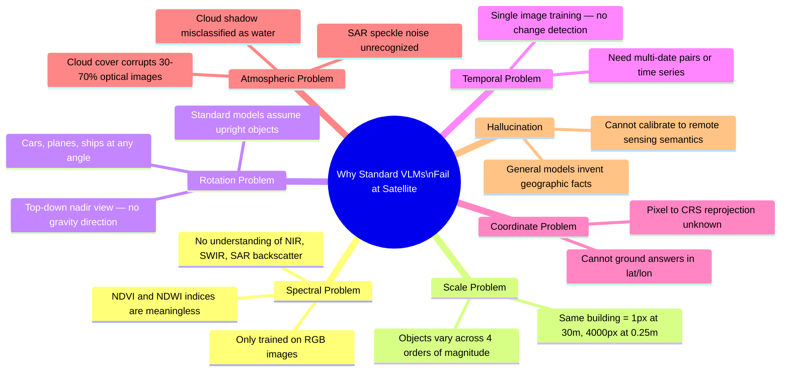

### Spectral Band Coverage — Standard VLM vs Remote Sensing Need

| Band | Wavelength | What It Reveals | Standard VLM |
|---|---|---|---|
| Blue | 490 nm | Atmosphere, water depth | YES (RGB) |
| Green | 560 nm | Vegetation reflectance | YES (RGB) |
| Red | 665 nm | Chlorophyll absorption | YES (RGB) |
| **NIR (B8)** | **842 nm** | **Healthy vegetation surge** | **NO** |
| **SWIR-1 (B11)** | **1610 nm** | **Soil moisture, burned area** | **NO** |
| **SWIR-2 (B12)** | **2190 nm** | **Mineral mapping, vegetation stress** | **NO** |
| **SAR C-band** | **5.6 cm** | **All-weather surface roughness, flood** | **NO** |

---

## 5. Existing Geospatial LLMs — State of the Art

### Model Landscape

| Model | Base Architecture | Training Data | Key Capabilities | Benchmark |
|---|---|---|---|---|
| **GeoChat** (2023) | LLaVA-1.5 + Vicuna-1.5 | 318K RS instruction dataset | Region grounding, VQA, classification | RSVQA-LR ~90%, RSVQA-HR ~85% |
| **RSGPT** | GPT-4V + RS datasets | RSICap + RSIEval | Detailed scene captioning | RSICap BLEU-4 = 0.67 |
| **EarthGPT** | Multi-modal LLM | Optical + SAR + Infrared pairs | Multi-sensor comprehension | Outperforms RSGPT on multi-sensor |
| **RemoteCLIP** | CLIP ViT-L/14 fine-tuned | RS image-text pairs | Zero-shot classification, retrieval | RS5M benchmark SoTA |
| **SkyEyeGPT** | LLaVA-style | SkyEye-968K unified dataset | Multi-turn dialogue, region tasks | Best on RSVQA, SceneQA |
| **GeoLLaVA** | LLaVA scaled for high-res | RS high-resolution imagery | Complex spatial reasoning on large tiles | Strong fine-grained analysis |
| **SkySense** | Billion-param foundation model | Temporal optical + SAR sequences | Multi-modal, multi-temporal | SoTA on change detection |
| **SatCLIP** | CLIP adapted for satellite | Sentinel-2 + geolocation metadata | Location embeddings for downstream tasks | Strong geo-prediction |

### GeoChat — Architecture Deep Dive (arXiv:2311.15826)

GeoChat is the most directly relevant model to SIH 26167:

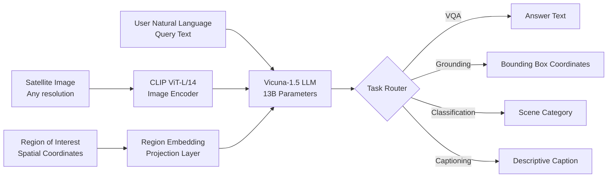

**GeoChat's 318K instruction dataset includes:**
- DOTA — Object detection in aerial images (15 object categories)
- DIOR — Object detection in optical RS (20 categories)
- RSVQA-LR/HR — Visual question answering for RS
- UC-Merced, AID, NWPU-RESISC45 — Scene classification (45 scene types)

---

## 6. Technical Deep Dive — Spectral Indices & Use Cases

### 6.1 Core Spectral Indices (Must be computable by the tool)

| Index | Formula | Threshold | Use Case |
|---|---|---|---|
| **NDVI** Vegetation | (NIR - Red) / (NIR + Red) | > 0.2: vegetation; > 0.6: dense healthy crops | Crop health, deforestation |
| **NDWI** Water | (Green - NIR) / (Green + NIR) | > 0: water bodies | Lake mapping, drought |
| **MNDWI** Modified Water | (Green - SWIR) / (Green + SWIR) | > 0.3: open water | Flood mapping (less urban noise) |
| **NDBI** Built-up | (SWIR - NIR) / (SWIR + NIR) | > 0: built-up areas | Urban sprawl detection |
| **NBR** Burned Ratio | (NIR - SWIR2) / (NIR + SWIR2) | delta > 0.1: recently burned | Wildfire damage |
| **EVI** Enhanced Vegetation | 2.5 × (NIR-Red)/(NIR+6Red-7.5Blue+1) | Better than NDVI in high-biomass | Dense forest |
| **SAR Flood Index** | Low backscatter sigma0 < -20 dB in VV | Smooth water = specular reflection | All-weather flood mapping |

### 6.2 Change Detection Algorithms

| Algorithm | Method | Best For |
|---|---|---|
| **Delta NDVI** | NDVI_after - NDVI_before | Vegetation loss, crop stress |
| **CVA (Change Vector Analysis)** | Magnitude + direction of change vector in feature space | Multi-band complex change |
| **Otsu Threshold** | Auto-threshold on difference image | Flood, deforestation binary maps |
| **LandTrendr** | Temporal segmentation of Landsat time series | Long-term forest disturbance |
| **Coherence Change Detection** | InSAR coherence drop pre/post event | Earthquake damage, landslide |

### 6.3 Use Case Coverage Map

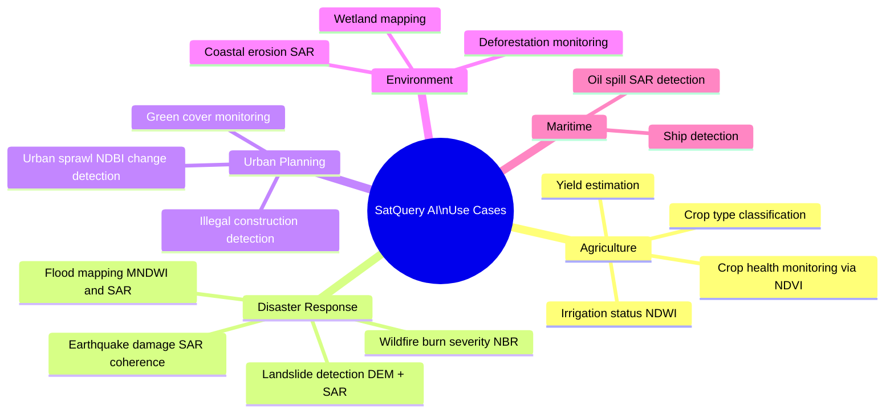

---

## 7. Multi-Agent Architecture — The ReAct Framework

### What is ReAct?

ReAct (Reasoning + Acting) is the core LLM orchestration pattern:
- **Thought:** "I need to get Sentinel-2 imagery of Kaziranga from June 2024 to compute NDVI..."
- **Action:** Call Earth Engine API with parameters
- **Observation:** API returns image collection metadata
- Repeat until answer is synthesized

### Multi-Agent System for Geospatial Queries

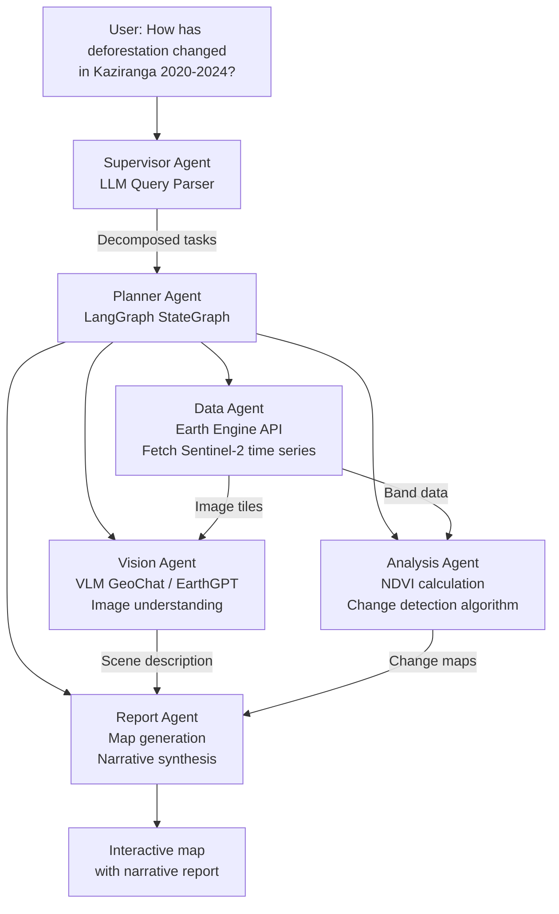

### Full Tool Library Available to Agents

| Tool | Library | What It Does |
|---|---|---|
| fetch_satellite_imagery | Google Earth Engine Python API | Retrieve image collections by AOI, date, cloud %, sensor |
| compute_index | Rasterio + NumPy | Compute NDVI, NDWI, NDBI, NBR on band data |
| detect_changes | SciPy + OpenCV | CVA, delta NDVI, Otsu thresholding on difference images |
| segment_objects | Samgeo — SAM for Geospatial | Auto-segment buildings, water, trees with geo-reference |
| visualize_map | Folium / Mapbox GL JS | Interactive web map with overlaid heatmaps/polygons |
| generate_report | LangChain + Jinja2 | Markdown/PDF report from analysis results |
| search_knowledge_base | ChromaDB + SatCLIP | Semantic search over satellite image archive |
| geocode | Nominatim / ISRO Bhuvan API | Convert place names to lat/lon bounding boxes |
| get_weather | IMD / MERRA-2 API | Correlate with historical precipitation/temperature |

---

## 8. Proposed Architecture — GeoAgent Framework

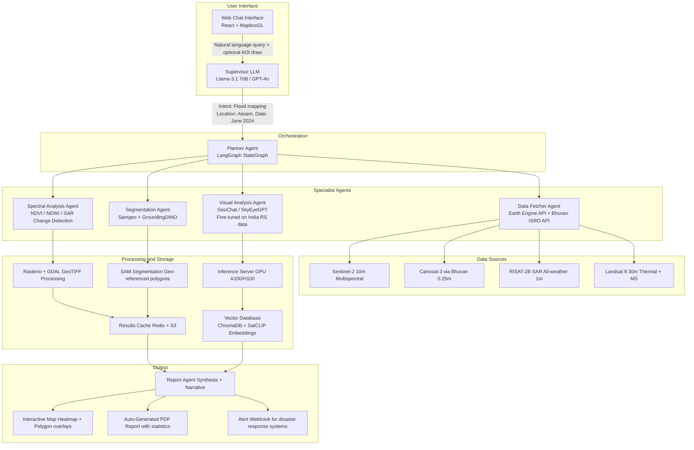

---

## 9. System & Data Flow Diagrams

### Full Query Processing Sequence

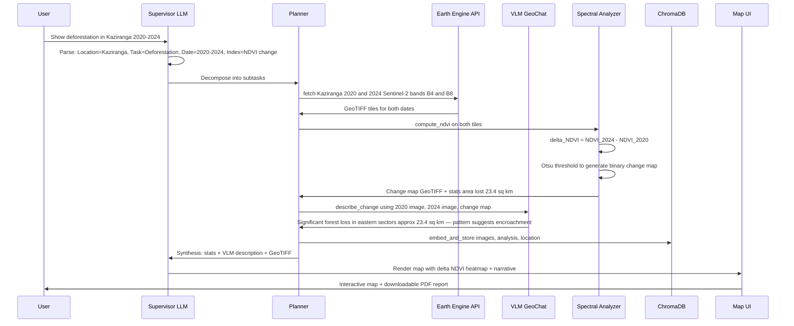

### Model Performance Comparison

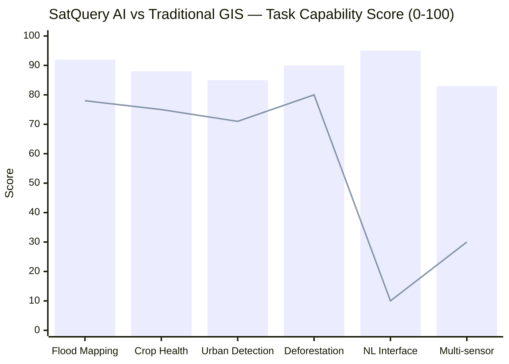
*Bar: SatQuery AI (proposed) | Line: Traditional GIS + manual scripting*

---

## 10. Model Training & Fine-Tuning Pipeline

### Architecture Choices

| Component | Options | Recommended | Reason |
|---|---|---|---|
| **Vision Encoder** | CLIP ViT-L/14 vs SatViT | **SatViT** | Pre-trained on Sentinel/Landsat; understands non-RGB bands |
| **LLM Backbone** | GPT-4o API vs Llama-3.1 70B | **Llama-3.1 70B** self-hosted | Data sovereignty; on Indian servers |
| **Fine-tuning** | Full fine-tune vs QLoRA 4-bit | **QLoRA** | Enables 70B fine-tuning on 2xA100; cost-effective |
| **Multimodal Bridge** | MLP Projection vs Q-Former | **MLP Projection** | Simpler, well-tested in GeoChat |
| **Context Length** | 4K tokens vs 128K tokens | **128K** | Multi-tile satellite analysis + long history |

### Training Data Composition

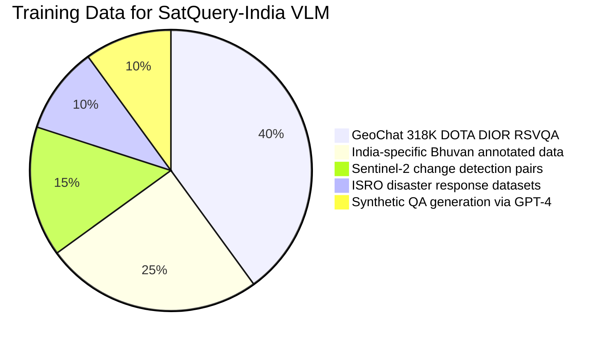

### Fine-Tuning Pipeline

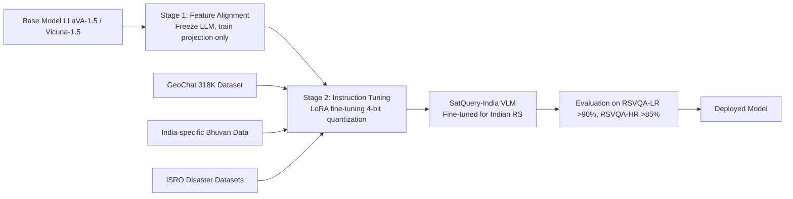

---

## 11. Vector Database & RAG for Satellite Search

### Why Vector Search Over Satellite Images?

User asks: *"Find me areas similar to the flooding pattern we saw in Assam in 2022."*
This requires **semantic image retrieval** — finding satellite tiles that visually and spectrally resemble a query.

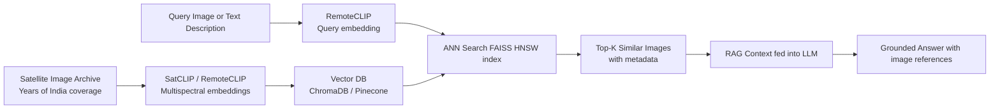

### Embedding Models Comparison

| Model | Training Data | Retrieval Task | Best For |
|---|---|---|---|
| **SatCLIP** | Sentinel-2 + geolocation metadata | Location embedding | Geo-predictive downstream tasks |
| **RemoteCLIP** | RS image-text pairs | Zero-shot classification + retrieval | General RS semantic search — RECOMMENDED |
| **GeoCLIP** | Ground-level photos + GPS | Ground-level geo-localization | Wrong domain for satellite |
| **CLIP ViT-L/14** | 400M general internet images | General image retrieval | Weak for non-RGB RS data |

---

## 12. Deployment — Data Sovereignty & Latency

### Data Sovereignty Framework (NGP 2022 + ISP 2023)

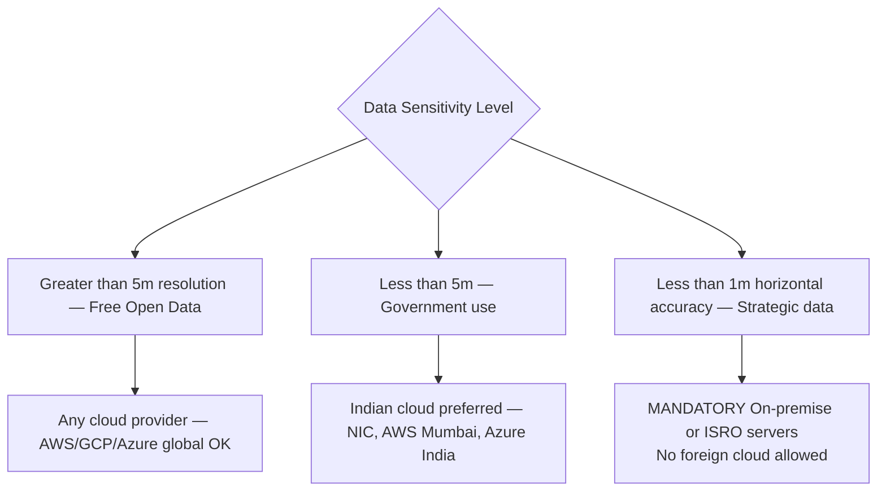

### Latency Requirements by Use Case

| Use Case | Acceptable Latency | Challenge | Solution |
|---|---|---|---|
| **Disaster Response Flood** | < 15 minutes | Full pipeline must be fast | Pre-computed SAR indices; edge inference |
| **Agricultural Monitoring** | < 1 hour | Not time-critical | Batch processing overnight |
| **Urban Sprawl Analysis** | < 24 hours | Large area, many tiles | Distributed Spark on Databricks |
| **Strategic Monitoring** | Real-time where possible | Sub-metre data, sovereign | On-premise GPU cluster at ISRO |

### Deployment Architecture (India Sovereign)

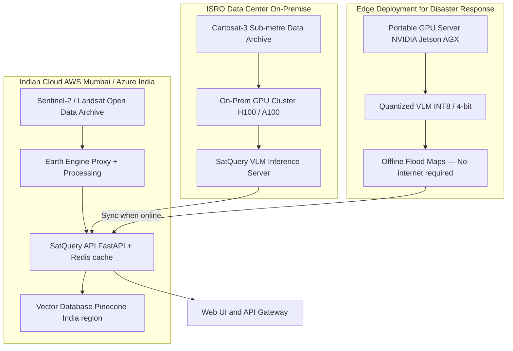

---

## 13. Technology Stack

| Layer | Technology | Justification |
|---|---|---|
| **VLM Base** | GeoChat / LLaVA-1.5 + Vicuna-1.5 | Proven RS performance; open-source |
| **Vision Encoder** | SatViT / CLIP ViT-L/14 | SatViT pre-trained on RS; understands NIR |
| **LLM Backbone** | Llama 3.1 70B self-hosted | Open-source; deployable on Indian servers |
| **Fine-tuning** | QLoRA 4-bit via Unsloth | Fine-tune 70B on 2xA100; cost-effective |
| **Orchestration** | LangGraph (ReAct multi-agent) | Stateful agent loops; tool use |
| **Satellite Data** | Google Earth Engine Python API | Petabytes of free satellite data, server-side |
| **SAR Processing** | ESA SNAP + snappy Python | RISAT-2B / Sentinel-1 SAR preprocessing |
| **Raster Processing** | Rasterio + GDAL + NumPy | GeoTIFF I/O, band math, CRS reprojection |
| **Segmentation** | Samgeo — SAM for Geospatial | Auto-segment RS objects with geo-reference |
| **Vector Database** | ChromaDB (local) / Pinecone (prod) | Satellite image semantic search |
| **Embeddings** | RemoteCLIP / SatCLIP | RS-domain image embeddings |
| **Backend API** | FastAPI Python | Async, supports ML model serving |
| **Frontend** | React.js + Mapbox GL JS + deck.gl | Interactive map + WebGL 3D terrain |
| **Map Tiles** | Bhuvan WMS / Mapbox satellite | India-specific basemaps |
| **Visualization** | Folium + Kepler.gl | Python-generated geospatial visualizations |
| **GPU Infra** | AWS EC2 p4d / Azure NCv3 India regions | A100 GPUs within data sovereignty bounds |

---

## 14. Expected Capabilities & Benchmarks

### Benchmark Targets

| Benchmark | Current SoTA | SatQuery AI Target |
|---|---|---|
| **RSVQA-LR** Low-Res VQA | GeoChat ~90% | **~92%** |
| **RSVQA-HR** High-Res VQA | GeoChat ~85% | **~87%** |
| **DOTA Object Detection mAP** | ~75% specialized detectors | ~70% VLM (more general) |
| **NWPU-RESISC45 Classification** | RemoteCLIP ~93% zero-shot | **>90%** with fine-tuning |
| **India Flood Mapping F1** | ~0.82 traditional | **>0.90** SAR + optical + VLM |
| **CHOICE Benchmark** | 2024 new standard | Evaluated post-deployment |

### Query Types the System Must Handle

| Query Type | Example | Technical Path |
|---|---|---|
| **Descriptive** | What land cover types are in this image? | VLM scene classification |
| **Analytical** | Calculate NDVI for Vidarbha in October 2024 | Earth Engine to Rasterio to index computation |
| **Comparative** | How has the Yamuna riverbed changed 2015-2024? | Multi-date fetch to CVA change detection to VLM narration |
| **Alerting** | Are there flooded areas in Assam right now? | Latest SAR to MNDWI to binary flood map to report |
| **Semantic Search** | Find areas similar to Sundarbans mangroves | RemoteCLIP embedding to ChromaDB ANN search |

---

## 15. Sources & References

1. [SIH 2026 Official Portal — SIH26167](https://sih.gov.in)
2. GeoChat — "Grounded Large Vision-Language Model for Remote Sensing" [arXiv:2311.15826](https://arxiv.org/abs/2311.15826)
3. [ISRO Bhuvan Portal](https://bhuvan.nrsc.gov.in)
4. [India's National Geospatial Policy 2022 — DST](https://dst.gov.in/national-geospatial-policy-2022)
5. [ISRO Space Policy 2023](https://www.isro.gov.in/isro-space-policy)
6. "RemoteCLIP: A Vision Language Foundation Model for Remote Sensing" [arXiv:2306.11029](https://arxiv.org/abs/2306.11029)
7. "EarthGPT: A Universal Multimodal Large Language Model for Multisensor Image Comprehension" — IEEE TGRS, 2024
8. "SkyEyeGPT: Unifying Remote Sensing Vision-Language Tasks via Instruction Tuning" [arXiv:2401.09712](https://arxiv.org/abs/2401.09712)
9. [Google Earth Engine API Documentation](https://developers.google.com/earth-engine)
10. [Segment Geospatial (Samgeo)](https://samgeo.gishub.org)
11. [LangGraph Documentation](https://langchain-ai.github.io/langgraph/)
12. "SkySense: A Multi-Modal Remote Sensing Foundation Model" [arXiv:2312.10115](https://arxiv.org/abs/2312.10115)
13. CHOICE Benchmark — "Comprehensive Hierarchical Evaluation for RS VLMs" [arXiv:2411.18145](https://arxiv.org/abs/2411.18145)
14. "SatCLIP: Global Location Embeddings with Satellite Imagery" [arXiv:2311.17179](https://arxiv.org/abs/2311.17179)
15. [GDAL/OGR Geospatial Data Abstraction Library](https://gdal.org)
16. [ESA Sentinel-2 Product Specification](https://sentinel.esa.int/web/sentinel/missions/sentinel-2)
17. [ISRO Cartosat-3 Mission Details — NRSC](https://www.nrsc.gov.in)
